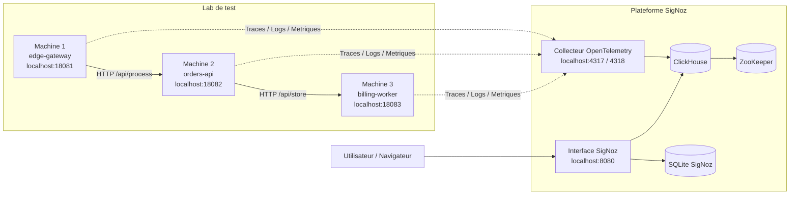
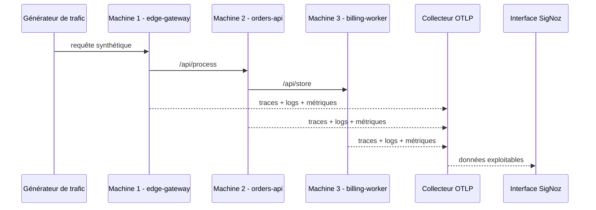

# Schéma d'architecture

Ce schéma présente l'architecture de la démonstration SigNoz avec la plateforme d'observabilité et les 3 machines simulées.

## Vue d'ensemble

## Lecture simple du schéma

- L'utilisateur accède à SigNoz via l'interface web.
- Les trois machines du lab simulent une petite application distribuée.
- Chaque machine envoie ses traces, logs et métriques au collecteur OpenTelemetry de SigNoz.
- Le collecteur stocke les données d'observabilité dans ClickHouse.
- SigNoz lit ces données pour les afficher dans les vues traces, logs, métriques et alertes.

## Flux applicatif

## Points à expliquer à l'oral

- SigNoz centralise les 3 piliers de l'observabilité : traces, logs et métriques.
- Le lab crée un parcours distribué entre 3 services.
- `billing-worker` produit volontairement des erreurs pour rendre la démonstration visible.
- Les alertes peuvent être construites à partir des métriques `lab_*` ou des erreurs visibles dans les traces et les logs.
