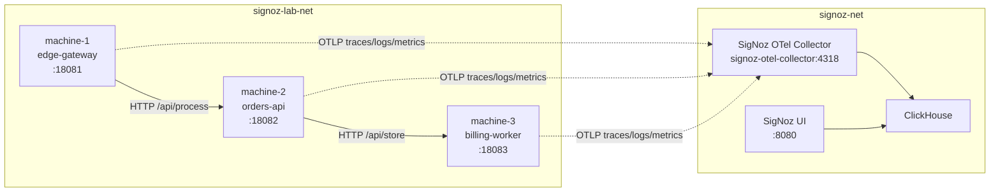

# Lab SigNoz avec 3 machines Docker

Ce lab ajoute un environnement de test réaliste autour de SigNoz en simulant **3 machines** sous Docker Compose. Chaque machine émet :

- des **traces distribuées**
- des **logs OTLP**
- des **métriques custom**
- un scénario simple pour **tester des alertes**

## Fichiers

- Stack SigNoz principale : [`/root/Signoz/compose.yaml`](/root/Signoz/compose.yaml)
- Extension GPU optionnelle : [`/root/Signoz/compose.gpu.yaml`](/root/Signoz/compose.gpu.yaml)
- Stack de lab : [`/root/Signoz/lab/compose.yaml`](/root/Signoz/lab/compose.yaml)
- Application simulée : [`/root/Signoz/lab/app/machine.py`](/root/Signoz/lab/app/machine.py)
- Schéma d'architecture : [`/root/Signoz/docs/schema-architecture.md`](/root/Signoz/docs/schema-architecture.md)
- Dashboards et alertes : [`/root/Signoz/docs/dashboards-alertes.md`](/root/Signoz/docs/dashboards-alertes.md)

## Architecture



## Flux fonctionnel

1. `machine-1` génère du trafic synthétique toutes les 3 secondes.
2. `machine-1` appelle `machine-2` sur `/api/process`.
3. `machine-2` appelle `machine-3` sur `/api/store`.
4. `machine-3` échoue volontairement de temps en temps pour produire :
   - traces en erreur
   - logs d’erreur
   - métriques d’échec

## Démarrage

### 1. Démarrer SigNoz

```bash
cd /root/Signoz
docker compose up -d
```

### 2. Démarrer le lab

```bash
cd /root/Signoz
docker compose -f lab/compose.yaml up -d --build
```

### 3. Vérifier les conteneurs

```bash
cd /root/Signoz
docker compose ps
docker compose -f lab/compose.yaml ps
```

### 4. Première connexion à SigNoz

Cette instance n'a pas d'identifiants par défaut.

Au premier accès sur `http://localhost:8080` :

1. crée le compte administrateur
2. définis l'adresse email de connexion
3. définis le mot de passe

Ces informations deviennent ensuite tes identifiants de connexion.

## Réseau

### Réseau `signoz-net`

Réseau partagé entre SigNoz et les 3 machines. Il permet l’envoi OTLP vers `signoz-otel-collector:4318`.

### Réseau `signoz-lab-net`

Réseau interne du scénario applicatif. Il porte uniquement les appels HTTP entre `machine-1`, `machine-2` et `machine-3`.

## Comment raccorder une nouvelle application ou machine

Le principe est toujours le même :

1. instrumenter l'application avec OpenTelemetry
2. envoyer la télémétrie vers le collecteur SigNoz
3. vérifier l'apparition du service dans l'interface

### Depuis la machine hôte

- OTLP gRPC : `localhost:4317`
- OTLP HTTP : `http://localhost:4318`

### Depuis un conteneur Docker sur `signoz-net`

- OTLP gRPC : `signoz-otel-collector:4317`
- OTLP HTTP : `http://signoz-otel-collector:4318`

### Depuis une machine distante

- utiliser l'IP ou le DNS du serveur SigNoz
- ouvrir les ports `4317` ou `4318` si nécessaire

### Variables d'environnement typiques

```bash
export OTEL_SERVICE_NAME=mon-service
export OTEL_EXPORTER_OTLP_ENDPOINT=http://localhost:4318
export OTEL_EXPORTER_OTLP_PROTOCOL=http/protobuf
export OTEL_RESOURCE_ATTRIBUTES=service.name=mon-service,deployment.environment=demo
```

## Ports exposés

- SigNoz UI : `http://localhost:8080`
- Machine 1 : `http://localhost:18081`
- Machine 2 : `http://localhost:18082`
- Machine 3 : `http://localhost:18083`

## Ce que tu verras dans SigNoz

### Traces

Tu verras rapidement des traces distribuées couvrant :

- `edge-gateway`
- `orders-api`
- `billing-worker`

Les spans en erreur apparaîtront surtout côté `billing-worker`, ce qui rend le flux utile pour les démonstrations APM.

### Logs

Chaque machine pousse ses logs directement en OTLP.

Exemples de recherches utiles dans l’explorateur de logs :

- `service.name = "edge-gateway"`
- `service.name = "orders-api"`
- `service.name = "billing-worker"`
- `body CONTAINS "request failed"`
- `body CONTAINS "write failed"`

### Métriques

Le lab crée plusieurs métriques custom :

- `lab_requests_total`
- `lab_errors_total`
- `lab_heartbeat_total`
- `lab_request_duration_ms`
- `lab_queue_depth`

Ces métriques sont enrichies avec :

- `service.name`
- `service.namespace`
- `deployment.environment`
- `machine`

### Infrastructure

La stack principale remonte aussi les metriques d'infrastructure :

- CPU hote
- memoire hote
- disque hote
- reseau hote
- metriques des conteneurs Docker

Et si le GPU NVIDIA est active :

- utilisation GPU
- memoire GPU
- temperature GPU

## Scénario d’alerte recommandé

Après ton premier login SigNoz, crée une alerte sur la hausse d’erreurs du lab.

### Option 1 : via l'interface

1. Ouvre `http://localhost:8080`
2. Termine l’initialisation du premier compte si nécessaire
3. Va dans `Alertes`
4. Cree une alerte metrique basee sur `lab_errors_total`
5. Filtre sur `service.name = billing-worker`
6. Définis un seuil du type :
   - alerte si la valeur est `> 0` sur les dernières minutes

### Option 2 : démonstration orientée latence

Crée une alerte sur `lab_request_duration_ms` pour `billing-worker` avec un seuil élevé afin de détecter les ralentissements.

## Vérifications rapides

### Vérifier les endpoints HTTP

```bash
curl http://localhost:18081/health
curl http://localhost:18082/health
curl http://localhost:18083/health
```

### Voir le trafic applicatif

```bash
docker logs -f signoz-lab-machine-1
docker logs -f signoz-lab-machine-2
docker logs -f signoz-lab-machine-3
```

### Arrêt du lab

```bash
cd /root/Signoz
docker compose -f lab/compose.yaml down
```

## Notes

- `machine-1` génère le trafic automatiquement, donc aucune action manuelle n’est nécessaire pour voir remonter les données.
- `machine-3` introduit volontairement des erreurs pour enrichir les démonstrations traces/logs/alerting.
- Le lab reste découplé de la stack SigNoz principale, ce qui permet de le monter et de le démonter sans toucher au cœur de la plateforme.
